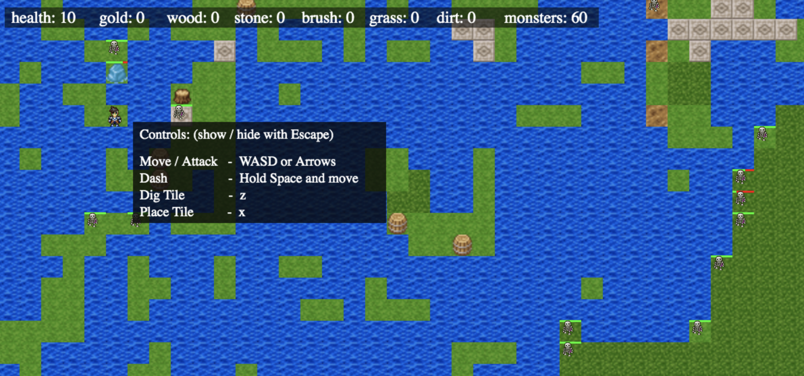

# Jabiru

Some kind of tilebased game using the creek engine. The randomly generated maps are created by a markov model that was trained on a large 2D map to recognize the frequencies of the occurences of different types of tiles together, and generated using a mechanism commonly referred to as 'wave function collapse'. You can take a look at [wcarss.ca/creek](https://wcarss.ca/creek) if you'd like!

### Authorship and License

Written by Wyatt Carss in 2018, whom you can read more about/by at [wcarss.ca](https://wcarss.ca). or spam freely at [carss.w@gmail.com](mailto:carss.w@gmail.com).

This project and its code, images, sounds, words, and any other resources are provided under the MIT License unless otherwise specified. See LICENSE.txt in the root of the project for the content of the License itself.
